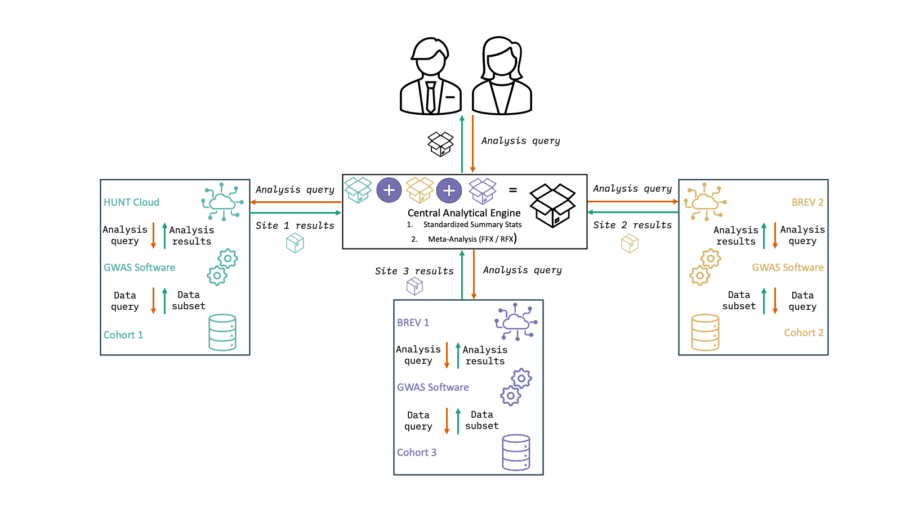

# FEDGX: Federated Learning Software for Multi-Tool Genome-Wide Association Studies across Cohort Sites
## Product of the Nordic Biobank x NVIDIA Hackathon

# Summary

At the Nordic Biobank x NVIDIA Hackathon, we aim to develop software for federated GWAS across three sites. 
For development, we test this approach in the HUNT Cloud and across two BREV sites. 

We will extend currently available code from the FedGen repository. 
https://github.com/collaborativebioinformatics/FedGen

____________________________

# Flowchart
  
____________________________
 

____________________________

## Initial Plan 

1. Synthetic dataset creation across 3 sites (genotype and phenotype)

- Use LDAK from DougSpeed.com
- Generate genotype across three different populations (ancestries)
- Genotype/phenotype mapping

2. Client pipeline for GWAS software in *Site 1, 2, 3*

- Extend to handle PLINK, GCTA, SAIGE, and custom approaches, over and above REGENIE
- Edits to server-side GWAS code to handle different GWAS calls
- Possibly LD structure handling

3. Standardization of summary stats in *Central Analytical Engine*

4. Meta-analyses in *Central Analytical Engine* using GWAMA

- FFX — currently implemented
- RFX — currently buggy
- Optionally develop LD structure weighted meta-analyses

5. Visualisation component (bonus, not core scope)

6. PRS (open question — not yet scoped)

____________________________

---

## Table of Contents
- [Quickstart](#quickstart----server-and-clients-configuration)
- [Data Documentation](#data-specifications)
- [Detailed Setup](#detailed-setup-instructions)
- [Troubleshooting](#troubleshooting)
- [References](#references)

---

____________________________

# Quickstart -- Server and Clients Configuration

## 1. Start NVFLARE Dashboard and FL Server on AWS


---

## 2. Start NVFLARE Client on Brev and HUNT Cloud

### 2.1 Create GPU Instance on Brev

On the **Brev website**:

* Create **1 GPU instance** per site
* Example configuration:
  * Name: `site1`
  * GPU: **1× NVIDIA L4**
  * CPU: **16 cores**
  * RAM: **64 GB**

---

### 2.2 Connect to the Instance

```bash
brev shell site1
```

Use terminal multiplexer to ensure connection persistence (Optional but recommended)

```bash
tmux new -s nvflare
```

---

### 2.3 Python Environment Setup

```bash
python3 -m venv venv_nvflare
source venv_nvflare/bin/activate

pip install nvflare[PT] torch torchvision tensorboard
```

Verify installation:

```bash
nvflare --version
```

---

## 3. Copy and Start NVFLARE Client Startup Kit

### 3.1 Copy Client Kit from Local Machine

On **local machine**:

```bash
brev copy <local_path_to_client_kit> site1:<remote_path>
```

On **Brev instance**:

```bash
sudo apt update
sudo apt install -y unzip

unzip -d <client_name> -P <PIN> <client_kit.zip>
cd <client_name>
```

### 3.2 Start NVFLARE Client

```bash
./startup/start.sh
```

Check logs to confirm successful connection to the NVFLARE server/dashboard.

---

## 4. Install AWS CLI on Each Brev Instance

From your **home directory**:

```bash
curl "https://awscli.amazonaws.com/awscli-exe-linux-x86_64.zip" -o "awscliv2.zip"
unzip awscliv2.zip
sudo ./aws/install
```

Verify:

```bash
aws --version
```

---

### 4.1 Configure AWS Credentials (Securely)

```bash
aws configure
```

Use **one** of the following secure approaches:

* IAM role attached to the instance (**recommended**)
* Environment variables (`AWS_ACCESS_KEY_ID`, `AWS_SECRET_ACCESS_KEY`)
* AWS credentials file

Example (DO NOT hardcode secrets):

```
AWS Access Key ID:     <YOUR_ACCESS_KEY>
AWS Secret Access Key: <YOUR_SECRET_KEY>
Default region name:  None
Default output format: None
```

---

## 5. Clone FedGX Repository

```bash
git clone https://github.com/collaborativebioinformatics/FedGX
chmod +x FedGen/scripts/*.sh
```

---

## 6. Download Site Data from S3

[SPECIFY METHOD HERE; SYNTHETIC DATA CODE AVAILABLE]


---

## 7. Run Regenie Per Site (Outside NVFLARE)

Run Regenie independently per site (not through NVFLARE) to verify all dependencies are working:

```bash
cd ~/data
./../FedGen/scripts/run_regenie_site.sh <siteNumber>
```

Monitor logs and outputs to confirm successful completion.

**Runtime:** ~30-45 minutes total
- Step 1 (LOCO model): 15-30 min
- Step 2 (association testing): 10-20 min

---

## 8. Run Federated GWAS Job (NVFLARE)

Instead of running REGENIE independently on each site and manually aggregating results, you can submit a federated GWAS job that automates the entire workflow across all sites using NVIDIA FLARE.

The federated job handles:
- Distributing analysis scripts to all clients
- Running local GWAS analysis using REGENIE on each site
- Collecting summary statistics from all sites
- Performing meta-analysis using GWAMA on the server

**For complete instructions on submitting federated GWAS jobs, see [`jobs/fed_gwas/README.md`](jobs/fed_gwas/README.md).**

---

## 9. Run GWAS Meta-Analysis using GWAMA from GWAS results generated across sites

- Convert REGENIE output to GWAMA input format
- Create Input File List
- Run GWAMA
- Interpret Output

---

## 10. Notes & Best Practices

* Use **one Brev instance per NVFLARE client**
* Always run NVFLARE client inside a virtual environment
* Prefer **IAM roles** over static AWS credentials
* Validate GPU availability:

  ```bash
  nvidia-smi
  ```
* Use `tmux` or `screen` to keep long‑running jobs alive

---

---

# Data Specifications

## Genotypes
- **Format:** PLINK binary (.bed/.bim/.fam)
- **Variants:** ~500K SNPs (450K-520K per site)
- **Samples:** ~100K individuals (88K-110K per site)
- **Chromosomes:** 22 autosomes
- **Build:** hg38
- **MAF:** Uniform distribution 0.01-0.5
- **LD:** Generated by LDAK (realistic structure)

## Phenotype
- **File:** `site{N}_pheno.pheno`
- **Format:** Space-delimited (FID IID Pheno)
- **Trait:** Parkinson's disease (binary: 0=control, 1=case)
- **Prevalence:** 1% (realistic for elderly populations)
- **Heritability:** h² = 0.25 on liability scale
- **Causal variants:** 20 per site
- **Effect size model:** LDAK-Thin (power = -0.25)

## Covariates
- **File:** `site{N}_geno.covar`
- **Auto-generated by LDAK**
- **Variables:** Age, sex, and other demographic covariates
- **Variance explained:** ~10% of phenotypic variation

---


# Detailed Setup Instructions

## Prerequisites


---

## Download Workflow

```bash
# 1. Clone repository (if not already done)
git clone https://github.com/collaborativebioinformatics/FedGen.git
cd FedGen

# 2. Download your assigned site (e.g., Site 3)
./scripts/download_site_from_s3.sh 3

# 3. Verify download
ls -lh data/simulated_sites/site3/
# Should show ~15 GB total:
# - site3_geno.bed (~12-13 GB)
# - site3_geno.bim (~10-20 MB)
# - site3_geno.fam (~2-3 MB)
# - site3_pheno.pheno (~2 MB)
# - site3_geno.covar (~5-10 MB)
```

---


## REGENIE Analysis Workflow

ALLAN?


---

### Run Analysis


---

## Understanding Results#

XIAOPING?

### Output Files

### Association Results Format
INSERT

**Key columns:**
INSERT


### Find Genome-Wide Significant Hits

### Manhattan Plot (R)


---


# Running GWAMA Meta-Analysis

---

## Meta-Analysis Workflow (Regenie Format)

### Step 1: Convert REGENIE Output to GWAMA Format

Each site's results must be converted to GWAMA input format:


Repeat for all 3 sites (site1 through site10).

---

### Step 2: Create Input File List

Create a file listing all site-specific GWAMA input files:


---

### Step 3: Run GWAMA


---

### Step 4: Interpret Output

GWAMA produces `FILENAME` with the following columns:
MOH?

**Key columns:**

**Interpreting heterogeneity:**


---


---

# Technologies

- **Data Generation:** [LDAK](https://dougspeed.com/) v6.1
- **GWAS Analysis:** [REGENIE](https://rgcgithub.github.io/regenie/) v4.1
- **Meta-Analysis:** [GWAMA](https://genomics.ut.ee/en/tools/gwama)
- **Containerization:** Docker
- **Data Storage:** AWS S3
- **FL Framework:** NVIDIA FLARE 2.7.1
- **Compute:** Brev instances for distributed sites

---

# References

## Software Citations

- **LDAK:** Speed et al. (2020). Improved heritability estimation from genome-wide SNPs. *Nature Genetics*. https://doi.org/10.1038/s41588-019-0530-8

- **REGENIE:** Mbatchou et al. (2021). Computationally efficient whole-genome regression for quantitative and binary traits. *Nature Genetics*. https://doi.org/10.1038/s41588-021-00870-7

- **GWAMA:** Mägi et al. (2010). GWAMA: software for genome-wide association meta-analysis. *BMC Bioinformatics*. https://doi.org/10.1186/1471-2105-11-288

- **This project:** [Add citation when published]

## Documentation Links

- **NVFLARE Documentation:** [https://nvflare.readthedocs.io/](https://nvflare.readthedocs.io/)
- **FedGen Repository:** [https://github.com/collaborativebioinformatics/FedGen](https://github.com/collaborativebioinformatics/FedGen)
- **Brev Platform:** [https://brev.dev](https://brev.dev)
- **REGENIE Documentation:** https://rgcgithub.github.io/regenie/
- **LDAK Documentation:** https://dougspeed.com/
- **PLINK File Formats:** https://www.cog-genomics.org/plink/1.9/formats

---

---

# License

Data and scripts: MIT License (see repository root)

# Contributors

---

# Team

Marlene Rietz (1-3)
Allan Lind-Thomsen (4)
Xiaoping Wu (5)
Moh Sallam
(6)
Pravesh Parekh (7-8)

## Affiliations

1.  Steno Diabetes Center Odense, Odense, Denmark

2.  P1 Pioneer Center for Artificial Intelligence, University of
    Copenhagen, Copenhagen Denmark

3.  Department of Laboratory Medicine, Karolinska Institutet, Stockholm,
    Sweden

4.  [INSERT ALLAN]

5.  Department of Obstetrics and Gynecology,Institute of Clinical
    Sciences, Sahlgrenska Academy, University of Gothenburg, Gothenburg,
    Sweden

6.  Center for Quantitative Genetics and Genomics and Pionner Center for
    Smartbiomed, Aarhus University

7.  J. Craig Venter Institute, San Diego, California, USA

8.  Centre for Precision Psychiatry, University of Oslo, Oslo, Norway


